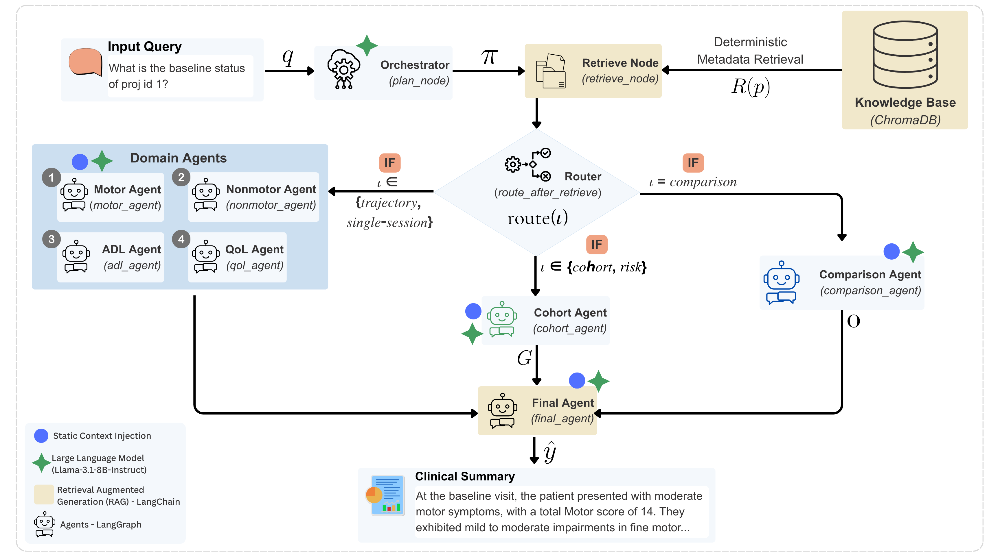
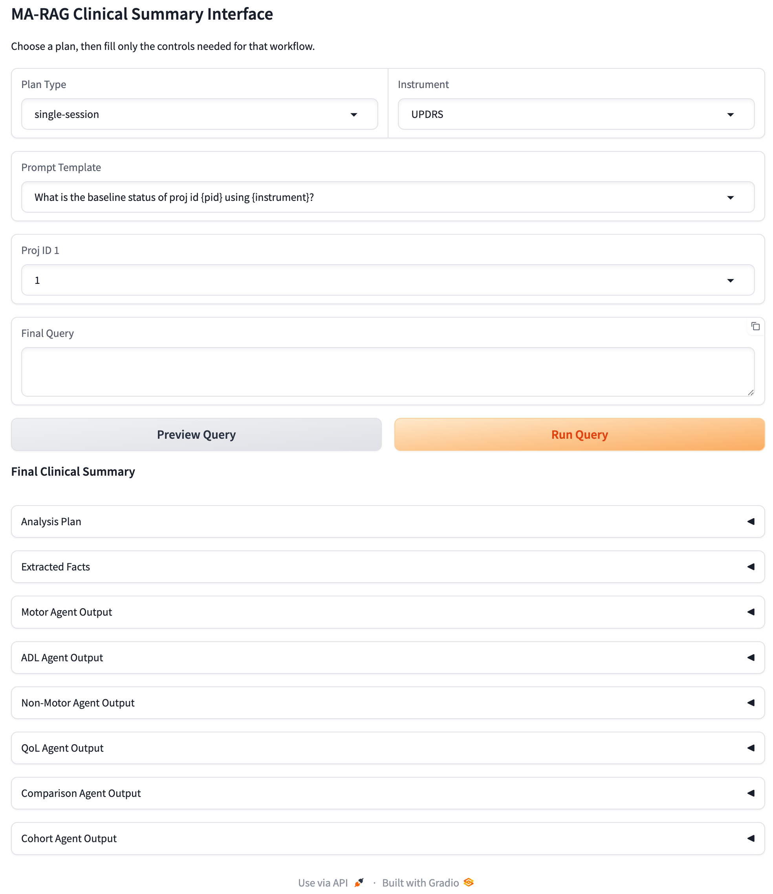

# MA-RAG: Multi-Agent Retrieval-Augmented Generation for Query-Driven Summarization of Longitudinal Parkinson's Disease Assessments

**MA-RAG** is a multi-agent retrieval-augmented generation framework for generating factually grounded longitudinal clinical summaries from multimodal assessment reports. The framework decomposes clinical reasoning into domain-specialized agents, combines structured fact extraction with deterministic score computation, and synthesizes verified summaries for four clinical analysis tasks: **Single-Session**, **Trajectory**, **Comparison**, and **Cohort** analysis. MA-RAG is designed to improve the factual reliability and clinical utility of LLM-generated summaries while reducing hallucinations during longitudinal clinical reasoning.

| System Overview | Gradio Interface |
|:---------------:|:----------------:|
|  |  |
| **Figure 1.** Overview of the proposed MA-RAG framework. | **Figure 2.** Interactive Gradio interface for clinical summarization. |

---

**Preprint:** [ArXiv](https://arxiv.org/abs/2608.28624)

## Project Structure

```text
├── app/
│   ├── agents/                 # Clinical reasoning agents
│   │   ├── __init__.py
│   │   ├── adl.py
│   │   ├── cohort.py
│   │   ├── comparison.py
│   │   ├── final.py
│   │   ├── motor.py
│   │   ├── nonmotor.py
│   │   ├── planner.py
│   │   ├── qol.py
│   │   └── router.py
│   ├── context/                # Label maps and scale definitions
│   │   ├── label_maps.py
│   │   └── scale_contexts.py
│   ├── retrieval/              # Data access and loading
│   │   ├── db.py
│   │   └── loader.py
│   ├── utils/                  # Shared utilities
│   │   ├── formatting.py
│   │   ├── parsing.py
│   │   ├── scoring.py
│   │   └── graph.py
│   ├── llm.py                  # LLM interface
│   ├── run.py                  # Core pipeline entry point
│   └── state.py                # Agent state definitions
├── knowledge_base/
│   └── clinical_agentic_db/    # ChromaDB for MA‑RAG
├── LICENSE
├── README.md
├── requirements.txt
└── run_ma_rag_gradio.py        # Gradio UI launcher
```

## Running the Gradio Interface

The repository includes a Gradio-based interface for interacting with the MA-RAG framework.

### 1. Install dependencies

```bash
pip install -r requirements.txt
```

### 2. Launch the application

From the root directory of the repository, run:

```bash
python run_ma_rag_gradio.py
```

After the server starts, Gradio will display a local URL (typically `http://127.0.0.1:7860`, and for public URL `https://c040c259e21739eb5b.gradio.live`) in the terminal. Open this URL in a web browser to access the interface.

### 3. Using the interface

The interface supports four analysis types:

- **Single-Session** – Summarize an individual clinical visit or compare baseline and latest visits for a patient.
- **Trajectory** – Generate a longitudinal summary of disease progression for a patient.
- **Comparison** – Compare disease progression between two or three patients.
- **Cohort** – Perform population-level analyses, including score extremes, deterioration, and risk assessment.

To execute a query:

1. Select the **Analysis Type**.
2. Select the **Clinical Instrument**.
3. Choose a predefined **Prompt Template**.
4. Select the required patient **Project ID(s)**.
5. Click **Preview Query** to inspect the generated query.
6. Click **Run Query** to execute the MA-RAG pipeline.

The interface displays:
- Final clinical summary
- Analysis plan
- Extracted clinical facts
- Outputs of the individual specialist agents (Motor, ADL, Non-Motor, QoL)
- Comparison or Cohort agent output (when applicable)


---

## Contact

For questions, suggestions, or collaborations, please contact:

**Sana Alamgeer** | sanaalamgeer (at) gmail (dot) com


---

## Citation
Coming soon...
<!--
If you use this repository in your research, please cite:

```bibtex
@article{alamgeer2026marag,
  title={Multi-Agentic Retrieval-Augmented Generation for Longitudinal Summarization of Multimodal Clinical Assessment Reports},
  author={Alamgeer, Sana and ...},
  journal={},
  year={2026}
}
```
-->
